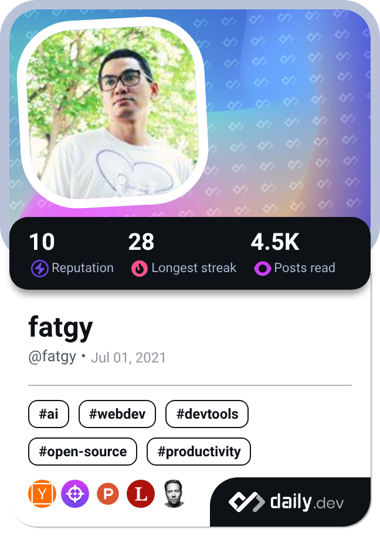

### Hi there 👋

#### I am a Web Developer working in Bangkok, Thailand.

- 🔭 I’m currently working on mini app use Line frontend framework, React, TypeScript and Mui.
- 🏢 I'm currently working at **E-Commerce Solution Co.,Ltd.**
- :gear: I use daily: `.js(x)`, `.ts(x)`, `.html`, `.css`
- 🌱 I’m currently learning TypeScript and always programming principles.
- ⚡ Fun fact: I think i am junior developer all the time because have a lot new things to learn.

<!--
**fatgy/fatgy** is a ✨ _special_ ✨ repository because its `README.md` (this file) appears on your GitHub profile.

Here are some ideas to get you started:

- 🔭 I’m currently working on ...
- 🌱 I’m currently learning ...
- 👯 I’m looking to collaborate on ...
- 🤔 I’m looking for help with ...
- 💬 Ask me about ...
- 📫 How to reach me: ...
- 😄 Pronouns: ...
- ⚡ Fun fact: ...
-->

